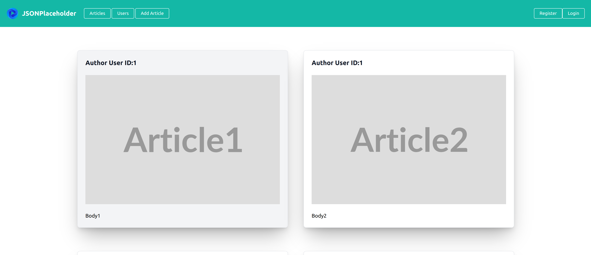
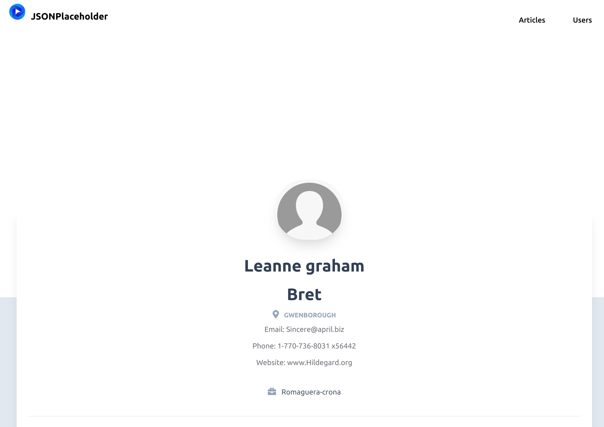

This program works with api.
https://jsonplaceholder.typicode.com/

JSONPlaceholder is a free online REST API that you can use whenever you need some fake data.

Now the program works with mysql database.

## Getting started

- download project
- run `composer install` to get necessary packages
- run `php -S localhost:7777` from public folder to start server
- click on site that appears in terminal to open it in browser
- have fun!

The program is writed in PHP 7.4 and includes

"guzzlehttp/guzzle": "^7.5",
"nikic/fast-route": "^1.3",
"twig/twig": "^3.5",
"ext-json": "*"
